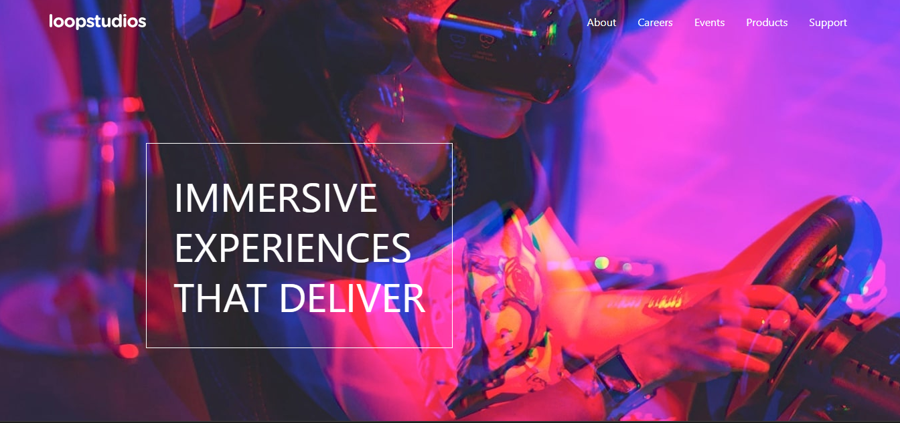

# 🏝️ Proyecto: Loopstudios Landing Page

Este proyecto consiste en el desarrollo de la **landing page de Loopstudios** utilizando **Astro** y **Tailwind CSS**.  
El objetivo es aplicar los conocimientos sobre **componentes de Astro**, **maquetación**, **estilos responsivos** y **utilidades CSS** para construir un diseño limpio, moderno y adaptable a diferentes dispositivos.

---

## 📖 Descripción general
En esta actividad desarrollarás la landing page de Loopstudios utilizando Astro y Tailwind CSS, con el objetivo de poner en práctica tus conocimientos en la creación de componentes, uso de estilos y diseño responsivo.

### 🧩 Vista previa del proyecto
Agrega aquí una **captura de pantalla** del resultado final de tu landing page.  

---

### 🔗 Enlaces del proyecto

- **Repositorio en GitHub:** [https://github.com/alemv19/Programacion-Web-Pra2](https://github.com/)
- **Sitio desplegado (opcional):** [https://programacion-web-pra2-z7g3.vercel.app/](https://vercel)

---

## 🧠 Proceso de desarrollo

### 🛠️ Tecnologías utilizadas
Lista las herramientas y tecnologías que utilizaste en el proyecto. Por ejemplo:

- [Astro](https://astro.build)
- [Tailwind CSS](https://tailwindcss.com/)
- HTML5 semántico
- Diseño responsivo (Mobile-first)
- Componentes de Astro reutilizables
- Interacciones con JavaScript (opcional para el toggle del menú móvil)
- Vercel

---

### 💡 Lo que aprendí
En el desarrollo de este proyecto reforcé mis conocimientos en el uso de herramientas modernas de desarrollo web, especialmente la integración de Astro con Tailwind para crear interfaces atractivas y responsivas. Aprendí a estructurar correctamente un proyecto, gestionar dependencias con npm y a trabajar con control de versiones mediante GitHub.

Además, comprendí la importancia del proceso de despliegue en plataformas como Vercel, configurando correctamente el directorio raíz, los comandos de build y la organización del proyecto para evitar errores como el 404. Esto me permitió entender mejor el flujo completo desde el desarrollo local hasta la publicación en línea.

---

### 🚀 Áreas de mejora

el desarrollo del proyecto identifiqué algunas áreas de mejora importantes. En primer lugar, necesito fortalecer la organización inicial del proyecto, especialmente en la estructura de carpetas y la correcta ubicación de archivos clave como package.json, ya que esto evita errores durante la instalación y el despliegue.

También debo mejorar el manejo de control de versiones en GitHub, evitando problemas como el uso involuntario de submódulos y asegurando que todos los archivos necesarios se agreguen correctamente antes de hacer commits.

Por último, es importante seguir practicando la configuración de despliegue en Vercel, entendiendo mejor parámetros como el root directory y los comandos de build, para lograr implementaciones más rápidas y sin errores.
---

### 👩‍💻 Autor

- **Nombre completo: Alexia Martinez Vazquez**  
- **Carrera: Ing. Tics**  
- **Grupo: TC1**  
- **Correo institucional:23151223@aguascalientes.tecnm.mx**  

---

### ✨ Reflexión final

Durante el desarrollo, lo más difícil fue configurar correctamente el despliegue y la estructura del proyecto, mientras que lo más fácil fue diseñar la interfaz con Astro y Tailwind. Disfruté ver cómo el proyecto funcionaba en línea. Aprendí sobre control de versiones en GitHub y despliegue en Vercel, conocimientos que aplicaré en futuros proyectos para trabajar de forma más organizada y eficiente.

